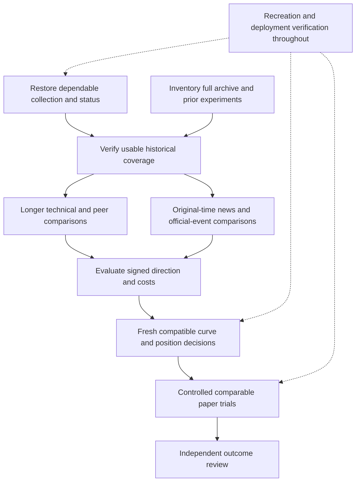

# Forex project status and roadmap — September 12, 2026

**The project has substantial reusable research, data and tested engineering. It does not yet have a demonstrated dependable trading edge or a fully operating integrated deployment.** The latest fresh local runtime inspection supersedes last night's running-status observations. Source implementations, historical performance, staged repairs, present process liveness and broker-confirmed account state are separate facts throughout this report.

This assessment reconciles the existing 27-item change register, model reuse register, 29-action historical crosswalk, recent study/restoration receipts and a new local runtime inspection. It is not a fresh rescore of every archived model or a new census of every raw historical row. No source code, trading configuration, account state or runtime process was changed for this roadmap.

**Fresh operating status.** At September 12 15:25:01 UTC (11:25:01 a.m. Eastern), Windows reported no Python/pythonw processes, no matching project PowerShell services and no dashboard listener on port 8765. Local status artifacts were read at 15:26:32 UTC. The new passive meter's last retained worker status, at 15:16:30 UTC, recorded 135 attempts, 135 capture errors and zero published captures; its refusal was `upstream_latest_cycle_not_successful`. The old status text saying a supervisor session was running did not establish a live process. Core quote/archive/forecast heartbeats were over 13 hours old. The cause of the interruption is not established by process absence alone.

The original practice trial ended by contract at September 11 20:45 UTC / 4:45 p.m. Eastern. Its retained local receipt at 20:45:02 UTC reports `completed_flat`, NAV $40.7708 and zero open positions/trades/orders. That is later completion evidence, but it is not a new September 12 broker query. Current broker positions, orders and NAV require a fresh reconciliation; no broker request was made for this status assessment.

| Subsystem at the fresh check | Last retained record | Current conclusion |
| --- | --- | --- |
| Quote stream / M1 archive | About September 12 02:22:57 UTC | Processes absent; heartbeat more than 13 hours old. Quote age alone during a weekend would not establish failure. |
| Independent clock verification | September 12 02:22:40 UTC | Stale; an old `ok` flag does not establish present clock trust. |
| News | September 12 15:15:51 UTC: 192 configured sources, zero attempted, `blocked_clock_integrity` | Last cycle opened no article database and wrote no prospective evidence; collector now absent. |
| Joint V3 / pair-local V2 forecasts | About September 12 02:22:59 UTC; zero forecasts in retained statuses | No operating forecast service or current forecast established. The old joint refusal was stale/future news at issue. |
| New continuous currency meter | September 12 15:16:30 UTC: 135 attempts, zero publications | Collector guard blocked input; no capture database; supervisor and worker now absent. |
| Practice trial | September 11 20:45:02 UTC: `completed_flat` | Local completion recorded; current broker state unqueried. |
| Dashboard | September 12 15:25:01 UTC process/port check | No listener on 8765; loopback connection did not succeed. |

**What exists, what is strong, and where it is weak.** “Staged” means implemented and tested outside the production route. “Historical” means a result belongs to its original sample and date. No test count below is a profitability score or proof that the entire repository passes.

| Area | Existing strengths and work to preserve | Weak point / current limit | Required change or evidence |
| --- | --- | --- | --- |
| Runtime and recovery | Existing watchdog and sign-in recovery; tested isolated scheduler and Windows I/O repairs; new passive supervisor with duplicate locks and bounded retries | Local Python services were absent at the fresh check. The new meter accumulated no captures before that interruption; independent clock verification remained stale. New-meter sign-in recovery was not installed. | Establish the interruption cause, resolve the clock dependency, verify each intended service and its output across restart and sign-in. Keep expired trials expired. |
| Market prices and archives | Canonical 68-pair M1 archive with distinct bid/ask/mid; older multi-year matrices and recovered S5 data; exact gap-aware label/evaluator code | Full raw historical coverage is not freshly reconciled. Earlier watch recorded 1,989 unresolved gap minutes. Candle-close time is not necessarily original provider receipt time. | One coverage/provenance inventory across canonical and recovered stores; declare available date ranges, gaps, duplicates, revisions and executable-price limitations per lane. |
| Actual use of history | Prior HGB matrix spans August 2024–July 2026; unified795 matrix spans June 2024–July 2026; newest loader preserves original news mappings and all 68 selected pairs | Latest direction/signed-cost study uses September 7–11 only. Historical final HGB fit capped at 100,000 rows; unified fit used 80,000 training rows from an already sampled matrix. None establishes full raw-archive consumption. | Extend verified price-only training/evaluation across eligible history; use original-time news only over supported overlap. Make any sampling or row cap explicit. |
| Technical features and co-movement | Real 227/267/795/643/223-field families; 251-field design catalogue; existing own/peer lag, ARIMA/error, conjunction and graph work | Last deployed H1 route used 34 inputs; new comparison used technical24 or combined108. A computed graph or available feature is not necessarily consumed by fitted weights. Wider models have also failed. | Trace each selected feature into the saved model; compare reused feature groups on identical dates and targets, including lagged currency/peer information. |
| Official news and currency strength | Official-source configuration spans 21 currencies; original mapping/visibility ledger, six-formula currency meter and strict 66-field pair projection exist | Configured coverage is not current successful ingestion. Numeric actual/previous values exist, but no consensus/revision/surprise values were found in the inspected capture. Old meter history is disjoint from the newest study. | Preserve timely official facts, pre-release expectations, revisions and rate repricing; evaluate base-minus-quote currency strength with its original availability. |
| News identity and retention | New capture retains exact raw versions, ordered manifests, all currency states and publication receipts; original and restored 133-test suites pass | New capture admits only prior-two-day article context; the offline admission audit excluded 299 additional source-ID/lineage mismatches. No new production capture succeeded. Upstream cross-query provenance remains unresolved. | Repair versioned source provenance without rewriting earlier first-seen history; collect valid new captures; join them prospectively with prices. |
| Blurbs and response analogies | Existing 7,048-move / 1,095-matched-headline audit and factor/episode studies; older official-response tests retained | Movement-selected examples can describe moves after they happen. Nonzero causal analogy support and generalization remain insufficient; blurbs were not joined to the newest learner. | Separate attribution labels from predictors available before a decision; reuse original independent event studies and test only materially changed information. |
| Direction and magnitude | Existing boosting, ridge, probabilistic and conditional-magnitude models; matched controls, saved-model recreation and independent result verification | Broad reliable after-cost direction is unestablished. Latest signed-cost selection overestimates signed movement; calibration improvements did not consistently produce positive returns. | Test longer-period direction and signed-return hypotheses with fixed baselines, costs, per-period results and honest coverage; preserve every negative result. |
| Horizon curves | Recovered ridge has 13 horizons from 15 seconds to 4 hours; new signed-cost consumer has 5/15/30/60-minute heads | Practice manager remains a separate original-H1 route. S5 first-real-bar targets and exact M1 endpoints differ. New curve component is not an operating broker manager. | Align reference prices, issue times, target times and actual availability, then publish fresh compatible updates into the existing manager. |
| Position management and costs | Ownership, reconciliation, original-time exits, broker stops, cost/risk checks and tested management corrections exist | Last trial used H1 expiry with a twice-ATR14 stop; spread consumed much of some stop distances. Conditional remaining-position risk and realistic execution comparison remain unproved. | Compare fixed hold and curve-driven entry/hold/exit/reduction on the same executable paths. Measure exit spreads, slippage, concentration and remaining risk separately. |
| Submission and daily accounting | Durable single-use claims prevent duplicate submissions; reviewed immutable-order validator and alternative accounting component exist | Original eight-claim cap counted never-submitted intents. Exact re-optimization equality caused refusals. Corrected components remain staged/unwired. | Deploy the reviewed candidate under a separately versioned trial; distinguish claims, definitely unsent attempts, ambiguous transport, transmitted orders and fills. |
| Accounts and paper trials | Historical account-role map and broker transaction reconciliation; finite budgets and cutoff controls | Twenty aliases / 21 roles are not 20 independently verified funded accounts. Latest fresh broker state was not obtained today. | Reconcile account identities, actual balances, positions, ownership and final settlement before splitting paper lanes; compare common opportunities and risk budgets. |
| Forecast status and diagnostics | Independent forecast-ledger verification already exists; immutable forecast/outcome identities and local error records | Producer generation mismatch, intermittent forecast gaps and overwritten error details remain unresolved in the canonical route | Reuse staged scheduling/I/O fixes; publish coherent status, bounded durable errors and actual publication/target clocks; verify behavior after deployment. |
| Recreation, storage and vault | Scoped packages restore selected models and exact new research; original and extracted tests and hashes retained; bounded deduplicated capture storage | Whole private-state recovery is incomplete. Some original checkpoints/schema links remain unresolved; whole-project long-run growth and reboot recovery are unverified. | Compose named source/model/data/environment profiles, separately provision private continuation state, test inactive restoration and controlled recovery, measure growth without deleting evidence. |
| Dashboard | Existing signals-versus-market view and independent ledger visibility | UI presence does not prove operational health; appearance is a low priority | Correct freshness/status distinctions alongside runtime fixes. Leave visual redesign until data, prediction and management work are resolved. |

**What the performance evidence actually says.** These rows describe different targets and periods; they are not a single leaderboard.

| Evidence | Retained result | Interpretation |
| --- | --- | --- |
| Last deployed joint34 H1 assessment, September 9 | 2,907 outcomes; 47.51% direction; mean net −4.6798 bps; Brier 0.253048 versus 0.25 | Direction and executable endpoint results were weak in that assessment. It is not today's cumulative rescore. |
| New technical/peer/news comparison, September 7–11 | All 32 learned aggregate net means negative | Combining the tested inputs did not establish an edge in that short reused-history comparison. |
| Signed-cost follow-up, fit September 7–8, calibration September 9, assessment September 10–11 | 39,893 assessment rows; 17 of 24 policies negative, four positive with limited/inconsistent support, three inactive | Calibration improved in all eight aggregates; no qualified replacement emerged. Overlapping rows are not independent trades or account P/L. |
| Older 164-input HGB opportunity detector | Development AUC about 0.6822 on its original opportunity task | A reusable movement/opportunity lead; it does not establish direction or profitable execution. |
| Earlier direction/two-stage filter | Direction AUC 0.5215; 53.76% filtered accuracy at 10.97% coverage; gate failed | Selecting fewer signals did not establish a qualified directional system. |
| Later retained practice watch, ending September 11 04:01 UTC | Nine filled-and-closed trades recorded; NAV $40.7708 versus $41.6042 start, decline $0.8334 (about 2.00%); no P/L change during that watch | This supersedes the earlier six-trade-only balance for that later cutoff. It is not a September 12 broker-confirmed balance or end-of-trial settlement. |

The model catalogue contains 140 family labels and 29,366 run records. Many records are unverified, smoke tests, variants or overlapping evaluations. Fourteen reference recipes were graded reconstructable but not revalidated, one partial and 125 unresolved. The catalogue helps avoid duplicate work; it does not certify that every model was independently reproduced or that all historical inputs already reach the live learner.

The historical news work is also broader than the newest V12 bridge: V11 has a separately recorded 29-market-day history, and older FOMC statements, projection releases and RBNZ event comparisons already exist. V12's August 27–September 5 interval, the new two-day capture reader and the latest September 7–11 training panel must not be mistaken for the entire news archive. The older cohorts retain their own timing limitations and often negative results; they need a reuse decision, not automatic replacement or automatic eligibility.

**Recommended order of work.** These phases reuse the existing backlog. Collection repair and archive analysis can proceed in parallel; scarce causal news should not prevent a longer technical comparison. A phase closes on its stated evidence, not on a higher feature count or more generated forecasts.

| Priority | Concrete work | Existing items / reuse | Evidence required to close |
| --- | --- | --- | --- |
| P0 — operating truth and continuity | Diagnose the present interruption; resolve independent clock verification; verify intended quote/archive/news/forecast services and dashboard; reconcile the expired trial's final state. Reuse existing restart routes and staged I/O/scheduling fixes. | FXG-001/002/003/006/007/008/017/022 | Fresh coherent statuses plus advancing outputs over multiple cadences; actual process ownership; no duplicate worker; actual shutdown/restart trace; dated broker settlement when separately checked. |
| P1 — archive and source coverage | Build one manifest of canonical/recovered prices, news versions, meter states, blurbs, models and feature schemas. Mark eligibility per training lane, actual date coverage, gaps and fit caps. Fix source-ID/version provenance. | FXG-009/011/012/018/024/027 | Reproducible coverage report and explicit included/excluded rows; original-time rules demonstrated; older usable price history retained independently of news gaps. |
| P2 — comparative prediction research | Reuse a compact baseline, existing HGB, lag/error/peer blocks and official currency-strength machinery. Compare technical-only, peer-only additions, news-only where support exists, and combined inputs on matched periods. | FXG-010/016/017/018 | Direction, signed-magnitude error, calibration, cost-adjusted decisions and coverage across separate periods; train-only fitting and transformation; no tuning on the reported final period. |
| P3 — curve and position economics | Make compatible fresh curve updates available to the existing manager; preserve each head's reference and target. Compare entry, hold, exit and reductions with fixed expiry. Add conditional remaining risk only where a policy actually consumes it. | FXG-013/014/015/021 | Matched executable-path comparison, realistic spread/cost treatment, decision receipts, verified reductions/settlement and currency-concentration accounting. If nothing improves decisions, retain the measured result. |
| P4 — controlled paper deployment | Wire reviewed preflight/accounting fixes; verify actual account alias separation and balances; define each lane's model, dates, budget, cutoff and comparison. Separate opportunity detection from the direction/entry decision. | FXG-004/005/019/022 | New explicit versioned trial; no retroactive reset of old claims/losses; final dispatch/reconciliation verified; original forecasts joined to fills and outcomes; independently compared lane results. |
| Throughout — recovery and evidence | Compose exact source/config/environment/model/data profiles; preserve external private state requirements; keep improvement/reuse/vault pointers current; measure history growth. | FXG-020/023/026 and FXG-011/012 | Inactive extraction reproduces selected outputs; required private state is enumerated; controlled sign-in/restart checked; source and evidence hashes resolve; no silent retention loss. |
| Last — presentation and low-priority legacy cleanup | Keep operational labels accurate now; simplify visuals later. Preserve the long tail of original INTRA/NEWS/TAG work until each exact requirement is resolved. | FXG-024/025 | Accurate live/forecast/position/result distinctions; any obsolete artifact removal supported by an explicit verified scope. |

**Every current change-register item remains accounted for.** This crosswalk prevents an attractive new roadmap from losing the earlier repairs.

| IDs | Weak point carried forward | Disposition in this roadmap |
| --- | --- | --- |
| 001–003 | Worker/status errors, stale-at-issue news, intermittent price-only gaps | P0: deploy/review the already staged repairs and observe the actual behavior. |
| 004–005 | Claim accounting and immutable-order preflight | P4: wire existing reviewed components into a new trial; preserve original ledger. |
| 006–008 | Mixed status generations, duplicate-dashboard prevention, lost failure detail | P0: coherent publication and durable diagnosis; reuse independent observer. |
| 009–010 | Archive gaps and later original forecast/trade outcomes | P1/P2: verified coverage and dated matched evaluation. |
| 011–012 | Reuse lineage and selected source/artifact compatibility gaps | P1/throughout: resolve the chosen recipes before fitting; no blanket replay of all catalogue runs. |
| 013–015 | Curve/risk target mismatch, remaining risk, manager integration | P3: fresh compatible references and measured management decisions. |
| 016 | Technical/co-movement/new-input comparison | P2: longer verified history and named changed hypotheses. |
| 017–018 | Currency-meter model consumption and official news inputs | P0/P1/P2: fresh retention, original-time joins and incremental evidence. |
| 019 | Account aliases, funding and exposure | P4: reconcile real independent paper lanes and risk budgets. |
| 020 | Full restoration composition and private continuation state | Throughout: scoped releases already verified; complete the specific missing dependencies. |
| 021–022 | Exit economics, restart behavior and final trial settlement | P0/P3/P4: dated operational and execution proof. |
| 023–024 | Vault export/navigation and all 29 historical actions | Throughout: preserve dated records and resolve exact remaining obligations. |
| 025–026 | Dashboard priority and long-run storage | Presentation last; bounded storage measured throughout. |
| 027 | Cross-query source-ID/version lineage | P1: upstream provenance repair and prospective verification. |

**Decision on model direction.** Preserve the opportunity detector, longer curve implementations, currency-strength machinery and existing technical/peer families. The next research question is whether their correctly timed information improves signed returns and useful position decisions on longer verified histories and separate periods. The evidence does not justify calling a particular combination the project's proven best setup. Choosing all 200+ fields indiscriminately is not the same as using the archive fully or tracing the intended information into fitted weights.

**Source records and current evidence.**

- [Fresh runtime audit](runtime/RUNTIME_SUMMARY_20260912T1526Z.md), [process/port proof](runtime/PROCESS_PORT_20260912T1525Z.json), and [20-artifact evidence](runtime/ARTIFACTS_20260912T1525Z.json).
- [Data/model status review](research/DATA_MODEL_STATUS.md).
- [Management/recreation status review](management/MANAGEMENT_RECREATION_STATUS.md).
- [Canonical change register](C:/Users/zmoor/Documents/forex/trad/docs/FOREX_CHANGE_REGISTER_20260911.md), [model reuse register](C:/Users/zmoor/Documents/forex/trad/docs/FOREX_MODEL_REUSE_REGISTER_20260911.md), and [29-action historical crosswalk](C:/Users/zmoor/Documents/forex/live_watch_20260910_2200/trial/RELOCATED_CENTRAL_PENDING_CROSSWALK_20260911.md).
- [Latest selected input inventory](C:/Users/zmoor/Documents/forex/direction_research_20260911/data_inventory/DATA_INVENTORY.md), [signed-cost study](C:/Users/zmoor/Documents/forex/direction_decision_20260911/DIRECTION_DECISION_REPORT.md), and [currency-meter history/bridge](C:/Users/zmoor/Documents/forex/direction_decision_20260911/event_bridge/EVENT_BRIDGE_REPORT.md).
- [Weekend staged setup](C:/Users/zmoor/Documents/forex/trad/docs/FOREX_WEEKEND_SETUP_20260911.md), [continuous capture implementation](C:/Users/zmoor/Documents/forex/currency_meter_continuous_20260912/README.md), and [later historical trial watch](C:/Users/zmoor/Documents/forex/live_watch_20260910_2200/trial/COMBINED_TWO_HOUR_TRIAL_WATCH_20260911.md).

The earlier automatic approval review rejected starting the clock-verification monitor with “blocked by policy,” supplying no further reason. This assessment did not retry the rejected action or relax the clock guards. Resolving that dependency remains part of P0; the rejection does not prevent offline archive work.
